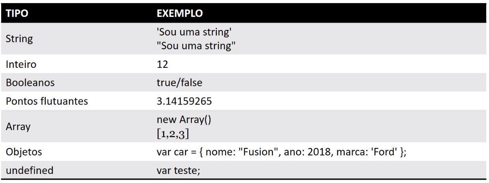
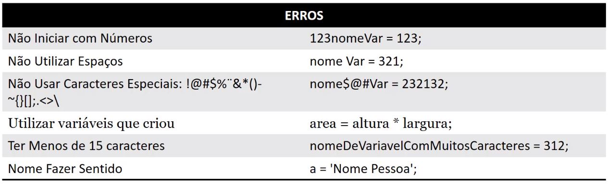

# CURSO JAVASCRIPT BÁSICO

https://academy.especializati.com.br/curso/javascript-basico

ESSE CURSO É ESPECIALMENTE PARA QUEM NUNCA JAMAIS TRABALHOU COM A MARAVILHA LINGUAGEM DE PROGRAMAÇÃO JAVASCRIPT (JS), NESTE CURSO ABORDAREMOS OS CONCEITOS BÁSICOS DA LINGUAGEM APLICANDO EM DIVERSOS EXEMPLOS REAIS.

## <a name="indice">Índice</a>

1. [Conceitos](#parte1)     
2. [Prático](#parte2)     
3. [Operadores Matemáticos](#parte3)     
4. [Operadores Condicionais](#parte4)     
5. [Funções](#parte5)     
6. [Arrays](#parte6)     
7. [Objetos](#parte7)     
8. [Loops de Repetição](#parte8)     
9. [Armazenamento de dados](#parte9)     
10. [Jogo](#parte10)     
11. [Nota](#parte11)     
---


## <a name="parte1">1 - Conceitos</a>

#### 01 - Apresentação Curso de JavaScript

- Documentação: [https://developer.mozilla.org/en-US/docs/Web/JavaScript/Reference](https://developer.mozilla.org/en-US/docs/Web/JavaScript/Reference)

- Documentação Extra: [http://devdocs.io/javascript/](http://devdocs.io/javascript/)

#### 02 - O que é o JavaScript


#### 03 - Ferramentas Curso de JavaScript

Google Chrome: [https://www.google.com/chrome/browser/desktop/index.html](https://www.google.com/chrome/browser/desktop/index.html)

Visual Studio Code: [https://code.visualstudio.com/](https://code.visualstudio.com/)

JSFiddle: [https://jsfiddle.net](https://jsfiddle.net)


[Voltar ao Índice](#indice)

---


## <a name="parte2">2 - Prático</a>

#### 01 - Primeiro Programa e Conceitos do JavaScript

- [02-Pratico/01-Primeiro-Programa-e-Conceitos-do-JavaScript.html](02-Pratico/01-Primeiro-Programa-e-Conceitos-do-JavaScript.html)

```html
<!doctype html>
<html lang="pt-BR">
<head>
    <meta charset="UTF-8">
    <meta name="viewport"
          content="width=device-width, user-scalable=no, initial-scale=1.0, maximum-scale=1.0, minimum-scale=1.0">
    <meta http-equiv="X-UA-Compatible" content="ie=edge">
    <title>01 - Primeiro Programa e Conceitos do JavaScript</title>

</head>
<body>

<!--<script>
    console.log("OK!")
</script>-->
<script src="js/app.js"></script>
</body>
</html>
```

- [02-Pratico/js/app.js](02-Pratico/js/app.js)

```js
console.log("OK! Script Separado")
```

#### 02 - Comentários de Código em JavaScript

```js
//console.log("OK! Script Separado")
console.log("OK! Script Separado")

/*
console.log("OK! Script Separado")
console.log("OK! Script Separado")
*/

```

#### 03 - Variáveis em JavaScript

```js
var jose = "José Malcher Jr.";
console.log(jose);
jose = 12345
console.log(jose);
jose = 1.23
console.log(jose);

```





#### 04 - Concatenação no JavaScript

```js
var name = "José Malcher Jr";
var age = 35;

console.log("O nome é " + name + " e tem idade de " + age);
```

[Voltar ao Índice](#indice)

---


## <a name="parte3">3 - Operadores Matemáticos</a>

#### 01 - Operadores Aritméticos JavaScript

- Documentação: https://developer.mozilla.org/pt-BR/docs/Web/JavaScript/Guide/Expressions_and_Operators#operadores_aritmeticos

```js
var n1 = 12;
var n2 = 4;

console.log(n1 + n2);
console.log(n1 - n2);
console.log(n1 * n2);
console.log(n1 / n2);
console.log(2  ** n2);
console.log(12  ** 1);

/*
16
8
48
3
16
12
*/
```

#### 02 - Ordem de Prioridade Operadores Aritméticos JavaScript

```js

console.log((4 - 2 + 3) * 2); // 10
console.log((4 - 2 + 2) / 2); // 2
console.log(((4 - 2 + 2) / 2 + 2) * 3); // 12

/*

1 - Parênteses
2 - Potenciação
3 - Multiplicação, Divisão, Resto e Divisão Inteira
4 - Adição, Subtração
*/

```

#### 03 - Operadores Aritméticos incremento e decremento JavaScript

```js
console.log(n1++) // 12
console.log(n1)   // 13
console.log(++n2) // 5
console.log(n2)   // 5

console.log(n1--) // 13
console.log(n1)   // 12
console.log(--n2) // 4
console.log(n2)   // 4
```

#### 04 - Operadores Aritméticos Resto da Divisão JavaScript

```js
console.log(n1 % 2); // 0
console.log(13 % 2); // 1
console.log(17 % 2); // 1
console.log(18 % 2); // 0
```

#### 05 - Operadores de Atribuição JavaScript

```js
var x1 = 20;
var x2 = 10;

//var result = n1 + 1;
x1 = x1 + 1;
console.log(x1); // 21

x2++;
console.log(x2); // 11
x2 += 2;
console.log(x2); // 13
x2 -= 2;
console.log(x2); //11
x2 *= 2;
console.log(x2); //22
x2 /= 2;
console.log(x2); //11

```

#### 06 - Operadores de Comparação JavaScript

```js

console.log(2 == 2); // true
console.log("jose" == "jose"); // true

console.log(2 === "2"); // false

console.log(2 === 2); // true
console.log(2 != 3); // true

console.log(2 !== "2"); // true

console.log(2 > 1); // true
console.log(2 < 1); // false
console.log(2 <= 2); // true
```

#### 07 - Operadores Lógicos JavaScript

```js
var y1 = 12;
console.log(typeof y1 == "number"); // true

console.log(typeof y1 == "number" && y1 == 12); // true
console.log(typeof y1 == "number" && y1 == 44); // false

console.log(typeof y1 == "number" || y1 == 44); // true
console.log(typeof y1 == "string" || y1 == 44); // false

console.log(!true); // false

```


[Voltar ao Índice](#indice)

---


## <a name="parte4">4 - Operadores Condicionais</a>


[Voltar ao Índice](#indice)

---


## <a name="parte5">5 - Funções</a>


[Voltar ao Índice](#indice)

---


## <a name="parte6">6 - Arrays</a>


[Voltar ao Índice](#indice)

---


## <a name="parte7">7 - Objetos</a>


[Voltar ao Índice](#indice)

---


## <a name="parte8">8 - Loops de Repetição</a>


[Voltar ao Índice](#indice)

---


## <a name="parte9">9 - Armazenamento de dados</a>


[Voltar ao Índice](#indice)

---


## <a name="parte10">10 - Jogo</a>


[Voltar ao Índice](#indice)

---


## <a name="parte11">11 - Nota</a>


[Voltar ao Índice](#indice)

---

